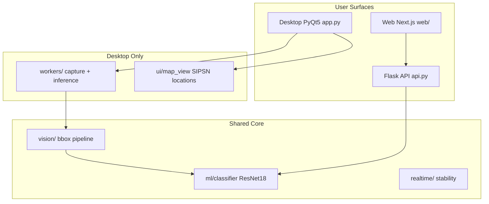
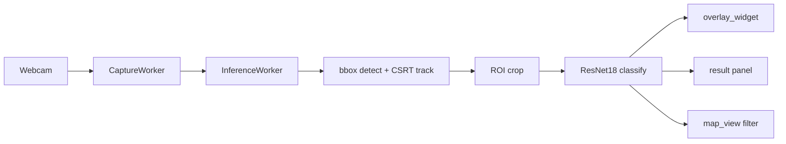
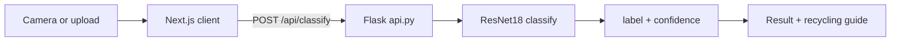
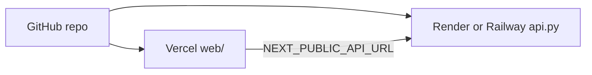

# PlastiTrace

Real-time plastic classification and recycling guidance powered by PyTorch ResNet18. PlastiTrace ships as a PyQt5 desktop app with live camera detection, a Next.js web classifier, and a Flask API backend.


**Classes:** HDPE, PET, PP, PS

---

## System overview



---

## Surface comparison

| Feature | Desktop (`app.py`) | Web (`web/`) | API (`api.py`) |
|---------|-------------------|--------------|----------------|
| Realtime camera detection | Yes | No (capture/upload) | N/A |
| Drop-off location map | Yes | No | No |
| Mobile-friendly | No | Yes | N/A |
| Modern UI | Yes (PyQt5) | Yes (Next.js) | N/A |
| Best for | Local realtime use | Browser / phone access | Backend integration |
| Deploy target | Local / PyInstaller | Vercel | Render / Railway / HF Spaces |

---

## Architecture

### Desktop pipeline

Realtime detection runs in worker threads so the GUI stays responsive.



### Web pipeline

The web app sends a single image per request (no realtime stream).



### Deployment topology



The frontend and API deploy separately. GitHub hosts source code; Vercel serves the Next.js app; a Python host runs the Flask API with the PyTorch model.

---

## Quick start

### Prerequisites

- Python 3.11+ (3.12 recommended; 3.14 may work but is less tested)
- Node.js 20+ (for web frontend)
- Webcam (desktop app)
- C++ build tools (for NumPy/OpenCV on some systems)

### Desktop app

```bash
python3 -m venv venv
source venv/bin/activate        # Windows: venv\Scripts\activate
pip install -r requirements.txt
python app.py
```

Press **ESC** or click **Stop** to end a session.

### Web app (local)

**Terminal 1 - API:**

```bash
source venv/bin/activate
python api.py
```

API runs at `http://localhost:5001` (port 5001 avoids macOS AirPlay conflict on 5000).

**Terminal 2 - Frontend:**

```bash
cd web
cp .env.example .env.local
npm install
npm run dev
```

Open `http://localhost:3000`.

### Deploy web to Vercel

1. Push the repo to GitHub.
2. Import the project in [Vercel](https://vercel.com).
3. Set **Root Directory** to `web`.
4. Add environment variable: `NEXT_PUBLIC_API_URL=https://your-api-host.com`
5. Deploy.

Configure CORS in `api.py` to allow your Vercel domain. The API must run on a Python-friendly host (Render, Railway, or Hugging Face Spaces).

---

## Project structure

```
PlastiTrace/
├── app.py                  # Desktop entry (PyQt5)
├── api.py                  # Flask REST API
├── requirements.txt
├── models/
│   └── plastitrace.pth     # ResNet18 weights
├── ml/
│   ├── classifier.py       # PyTorch ResNet18 wrapper
│   ├── config.py           # Classes + recycling copy (ID)
│   └── preprocess.py
├── vision/
│   ├── bbox_detector.py    # Contour-based detection
│   ├── bbox_tracker.py     # CSRT/KCF tracker
│   └── smoothing.py        # EMA smoothing
├── realtime/
│   └── stability.py        # Prob smoother + hysteresis labels
├── workers/
│   ├── capture_worker.py   # Camera thread
│   └── inference_worker.py # Inference thread
├── ui/
│   ├── main_window.py      # 3-panel desktop shell
│   ├── video_widget.py     # Camera preview
│   ├── overlay_widget.py   # Bbox + label overlay
│   └── map_view.py         # Leaflet drop-off map
├── location/               # SIPSN drop-off data + filtering
├── domain/                 # Location models + geo utils
├── trust/                  # Frame quality + decision engine
├── feedback/               # Scan dataset + evaluation
├── data/                   # Geocoded locations + seed JSON
├── assets/map/             # Leaflet HTML template
└── web/                    # Next.js frontend (Vercel)
    ├── app/
    ├── components/
    └── lib/
```

---

## API reference

### `POST /api/classify`

Classify plastic from an uploaded image.

**Request:** `multipart/form-data` with field `image` (file)

**Response:**

```json
{
  "label": "PET",
  "confidence": 0.95
}
```

### `GET /api/health`

**Response:**

```json
{
  "status": "ok"
}
```

---

## Model

- **Architecture:** ResNet18 fine-tuned for 4-class plastic classification
- **Weights:** `models/plastitrace.pth`
- **Input:** 224x224 RGB, ImageNet normalization
- **Classes:** HDPE, PET, PP, PS

Recycling recommendations (Bahasa Indonesia) are defined in `ml/config.py` and mirrored in `web/lib/recommendations.ts`.

---

## Configuration

### Desktop defaults (`ui/main_window.py`)

| Setting | Default | Description |
|---------|---------|-------------|
| Camera index | 0 | Webcam device |
| Inference interval | 3 | Classify every N frames |
| Confidence threshold | 0.65 | Minimum confidence to show label |
| Stabilization | On | EMA + hysteresis anti-flicker |

### API defaults (`api.py`)

| Setting | Default | Description |
|---------|---------|-------------|
| Host | `0.0.0.0` | Bind address |
| Port | `5001` | HTTP port |
| CORS | All origins | Restrict in production |

### Web (`web/.env.local`)

| Variable | Example | Description |
|----------|---------|-------------|
| `NEXT_PUBLIC_API_URL` | `http://localhost:5001` | Flask API base URL (no trailing slash) |

---

## Troubleshooting

### Desktop

| Problem | Fix |
|---------|-----|
| `No OpenCV tracker available` | `pip install opencv-contrib-python` |
| `No module named 'PyQt5'` | `pip install PyQt5 PyQtWebEngine` |
| Low FPS | Increase inference interval in the UI settings panel |
| Camera not found | Change camera index; check macOS camera permissions |

### Web

| Problem | Fix |
|---------|-----|
| Port 5001 in use | Change port in `api.py` and update `NEXT_PUBLIC_API_URL` |
| Camera blocked | Use HTTPS in production; grant browser permission |
| Classification failed | Ensure API is running; check `models/plastitrace.pth` exists |
| CORS errors | Install `flask-cors`; restrict origins in production |

---

## Contributing

See [CONTRIBUTING.md](CONTRIBUTING.md) for development setup, verification steps, and submission guidelines.

---

## License

[Your License Here]
