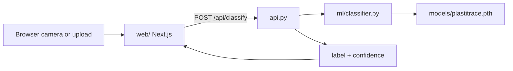
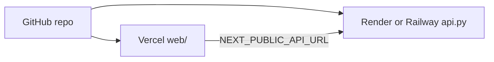

# PlastiTrace

Plastic classification and recycling guidance powered by PyTorch ResNet18. Upload or photograph plastic, get the type (HDPE, PET, PP, PS), and read Indonesian recycling recommendations.


**Classes:** HDPE, PET, PP, PS

---

## Architecture



The frontend and API deploy separately. Vercel hosts the Next.js app; a Python host (Render, Railway, or Hugging Face Spaces) runs the Flask API with the PyTorch model.

---

## Quick start

### Prerequisites

- Python 3.11+ (3.12 recommended)
- Node.js 20+
- Model weights at `models/plastitrace.pth`

### Local development

**Terminal 1 - API:**

```bash
python3 -m venv venv
source venv/bin/activate        # Windows: venv\Scripts\activate
pip install -r requirements.txt
python api.py
```

API runs at `http://localhost:5001` (port 5001 avoids macOS AirPlay conflict on 5000).

**Terminal 2 - Frontend:**

```bash
cd web
cp .env.example .env.local
npm install
npm run dev
```

Open `http://localhost:3000`.

---

## Deploy

### Frontend (Vercel)

1. Push the repo to GitHub.
2. Import the project in [Vercel](https://vercel.com).
3. Set **Root Directory** to `web`.
4. Add environment variable: `NEXT_PUBLIC_API_URL=https://your-api-host.com`
5. Deploy.

### API (Render / Railway / HF Spaces)

1. Deploy `api.py` with `requirements.txt` and `models/plastitrace.pth`.
2. Use Gunicorn in production:

```bash
pip install gunicorn
gunicorn -w 2 -b 0.0.0.0:5001 api:app
```

3. Set `debug=False` and restrict CORS to your Vercel domain in `api.py`.
4. Serve over HTTPS (required for mobile camera access on the web app).



---

## Project structure

```
PlastiTrace/
├── api.py                  # Flask REST API
├── requirements.txt
├── ml/
│   ├── classifier.py       # ResNet18 wrapper
│   ├── config.py           # Classes + recycling copy (ID)
│   └── preprocess.py
├── models/
│   └── plastitrace.pth
└── web/                    # Next.js frontend
    ├── app/
    ├── components/
    └── lib/
```

---

## API reference

### `POST /api/classify`

Classify plastic from an uploaded image.

**Request:** `multipart/form-data` with field `image` (file)

**Response:**

```json
{
  "label": "PET",
  "confidence": 0.95
}
```

### `GET /api/health`

**Response:**

```json
{
  "status": "ok"
}
```

---

## Model

- **Architecture:** ResNet18 fine-tuned for 4-class plastic classification
- **Weights:** `models/plastitrace.pth`
- **Input:** 224x224 RGB, ImageNet normalization
- **Classes:** HDPE, PET, PP, PS

Recycling recommendations (Bahasa Indonesia) are defined in `ml/config.py` and mirrored in `web/lib/recommendations.ts`.

---

## Configuration

| Component | Setting | Default |
|-----------|---------|---------|
| API host | `api.py` | `0.0.0.0:5001` |
| API CORS | `api.py` | All origins (restrict in production) |
| Web API URL | `web/.env.local` | `NEXT_PUBLIC_API_URL=http://localhost:5001` |

---

## Troubleshooting

| Problem | Fix |
|---------|-----|
| Port 5001 in use | Change port in `api.py`; update `NEXT_PUBLIC_API_URL` |
| Camera blocked in browser | Use HTTPS in production; grant camera permission |
| Classification failed | Ensure API is running; verify `models/plastitrace.pth` exists |
| CORS errors | Install `flask-cors`; allow your Vercel origin in production |
| macOS AirPlay on port 5000 | Already using 5001; disable AirPlay Receiver if needed |

---

## Contributing

See [CONTRIBUTING.md](CONTRIBUTING.md) for development setup and submission guidelines.

---

## License

[Your License Here]
